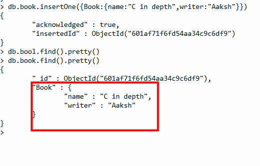
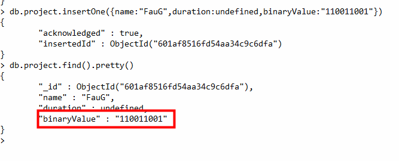
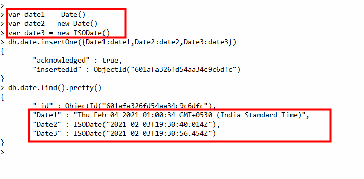
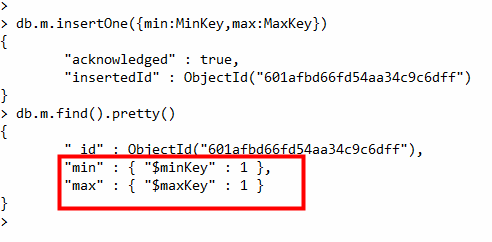
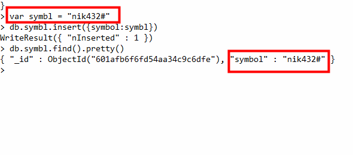
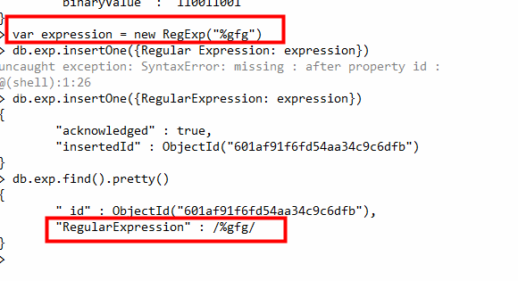
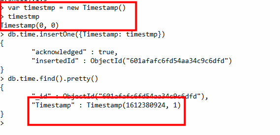
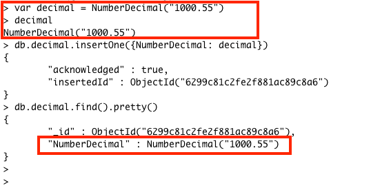

# MongoDB Data Types
In MongoDB, the documents are stored in BSON, which is the binary encoded format of JSON and using BSON we can make remote procedure calls in MongoDB. BSON data format supports various data types.

# 1. String
This is the most commonly used data type in MongoDB to store data, BSON strings are of UTF-8. So, the drivers for each programming language convert from data types to the string format of the language to UTF-8 while serializing and de-serializing BSON. The string must be a valid UTF-8. 

# 2. Integer
In MongoDB, the integer data type is used to store an integer value. We can store integer data type in two forms 32-bit signed integer and 64-bit signed integer.

# 3. Double
The double data type is used to store the floating-point values. 

# 4. Boolean
The boolean data type is used to store either true or false.

# 5. Null
The null data type is used to store the null value.

# 6. Array
The Array is the set of values. It can store the same or different data types values in it. In MongoDB, the array is created using square brackets([]). 

# 7. Object
Object data type stores embedded documents. Embedded documents are also known as nested documents. Embedded document or nested documents are those types of documents which contain a document inside another document.

# 8. Object Id
Whenever we create a new document in the collection MongoDB automatically creates a unique object id for that document(if the document does not have it). There is an _id field in MongoDB for each document. The data which is stored in Id is of hexadecimal format and the length of the id is 12 bytes which consist:

4-bytes for Timestamp value.
5-bytes for Random values. i.e., 3-bytes for machine Id and 2-bytes for process Id.
3- bytes for Counter
You can also create your own id field, but make sure that the value of that id field must be unique.

# 9. Undefined
This data type stores the undefined values.

# 10. Binary Data
This datatype is used to store binary data. 

# 11. Date
Date data type stores date. It is a 64-bit integer which represents the number of milliseconds. BSON data type generally supports UTC datetime and it is signed. If the value of the date data type is negative then it represents the dates before 1970. There are various methods to return date, it can be returned either as a string or as a date object. Some method for the date:

Date(): It returns the current date in string format.
new Date(): Returns a date object. Uses the ISODate() wrapper. 
new ISODate(): It also returns a date object. Uses the ISODate() wrapper.

# 12. Min & Max key
Min key compares the value of the lowest BSON element and Max key compares the value against the highest BSON element. Both are internal data types.

# 13. Symbol
This data type similar to the string data type. It is generally not supported by a mongo shell, but if the shell gets a symbol from the database, then it converts this type into a string type.

# 14. Regular Expression
This datatype is used to store regular expressions.

# 15. JavaScript
This datatype is used to store JavaScript code into the document without the scope.

# 17. Timestamp
In MongoDB, this data type is used to store a timestamp. It is useful when we modify our data to keep a record and the value of this data type is 64-bit. The value of the timestamp data type is always unique.

# 18. Decimal
This MongoDB data type store 128-bit decimal-based floating-point value. This data type was introduced in MongoDB version 3.4
