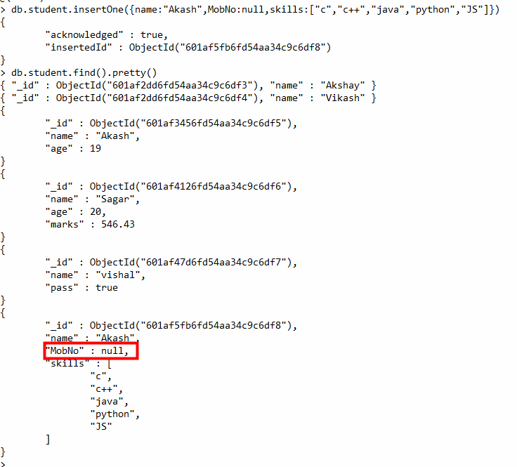

# MongoDB Data Types
In MongoDB, the documents are stored in BSON, which is the binary encoded format of JSON and using BSON we can make remote procedure calls in MongoDB. BSON data format supports various data types.

# 1. String
This is the most commonly used data type in MongoDB to store data, BSON strings are of UTF-8. So, the drivers for each programming language convert from data types to the string format of the language to UTF-8 while serializing and de-serializing BSON. The string must be a valid UTF-8. 

# 2. Integer
In MongoDB, the integer data type is used to store an integer value. We can store integer data type in two forms 32-bit signed integer and 64-bit signed integer.

# 3. Double
The double data type is used to store the floating-point values. 

# 4. Boolean
The boolean data type is used to store either true or false.

# 5. Null
The null data type is used to store the null value.

# 6. Array
The Array is the set of values. It can store the same or different data types values in it. In MongoDB, the array is created using square brackets([]). 

# 7. Object
Object data type stores embedded documents. Embedded documents are also known as nested documents. Embedded document or nested documents are those types of documents which contain a document inside another document.

# 8. Object Id
Whenever we create a new document in the collection MongoDB automatically creates a unique object id for that document(if the document does not have it). There is an _id field in MongoDB for each document. The data which is stored in Id is of hexadecimal format and the length of the id is 12 bytes which consist:

4-bytes for Timestamp value.
5-bytes for Random values. i.e., 3-bytes for machine Id and 2-bytes for process Id.
3- bytes for Counter
You can also create your own id field, but make sure that the value of that id field must be unique.

# 9. Undefined
This data type stores the undefined values.

# 
DataTypes in MongoDB
Last Updated : 22 Oct, 2024
MongoDB uses BSON (Binary JSON) to store documents and offers robust support for a diverse range of data types which enables flexible and efficient data management.

In this article, We will learn about the data types in MongoDB by understanding the various data types in detail.

MongoDB Data Types
In MongoDB, the documents are stored in BSON, which is the binary encoded format of JSON and using BSON we can make remote procedure calls in MongoDB. BSON data format supports various data types.

MongoDB supports a wide range of data types, from strings to arrays. If you’re looking to fully understand MongoDB data structures and how they integrate into full-stack applications, the Full Stack Development with Node JS course provides in-depth lessons on working with diverse data types in MongoDB.

Below are the enlisted MongoDB data types:

# 1. String
This is the most commonly used data type in MongoDB to store data, BSON strings are of UTF-8. So, the drivers for each programming language convert from data types to the string format of the language to UTF-8 while serializing and de-serializing BSON. The string must be a valid UTF-8. 

Example: In the following example we are storing the name of the student in the student collection:

Here, the data type of the value of the name field is a string.

2. Integer
In MongoDB, the integer data type is used to store an integer value. We can store integer data type in two forms 32-bit signed integer and 64-bit signed integer.

Example: In the following example we are storing the age of the student in the student collection:

3. Double
The double data type is used to store the floating-point values. 

Example: In the following example we are storing the marks of the student in the student collection:

# 4. Boolean
The boolean data type is used to store either true or false.
Example: In the following example we are storing the final result of the student as pass or fail in boolean values.

# 5. Null
The null data type is used to store the null value.

Example: In the following example,  the student does not have a mobile number so the number field contains the value null.

# 6. Array
The Array is the set of values. It can store the same or different data types values in it. In MongoDB, the array is created using square brackets([]). 

Example: In the following example, we are storing the technical skills of the student as an array.

# 7. Object
Object data type stores embedded documents. Embedded documents are also known as nested documents. Embedded document or nested documents are those types of documents which contain a document inside another document.

Example: In the following example, we are storing all the information about a book in an embedded document.

# 8. Object Id
Whenever we create a new document in the collection MongoDB automatically creates a unique object id for that document(if the document does not have it). There is an _id field in MongoDB for each document. The data which is stored in Id is of hexadecimal format and the length of the id is 12 bytes which consist:

4-bytes for Timestamp value.
5-bytes for Random values. i.e., 3-bytes for machine Id and 2-bytes for process Id.
3- bytes for Counter
You can also create your own id field, but make sure that the value of that id field must be unique.

Example: In the following example, when we insert a new document it creates a new unique object id for it.

# 9. Undefined
This data type stores the undefined values.

Example: In the following example the type of the duration of the project is undefined.

# 10. Binary Data
This datatype is used to store binary data. 