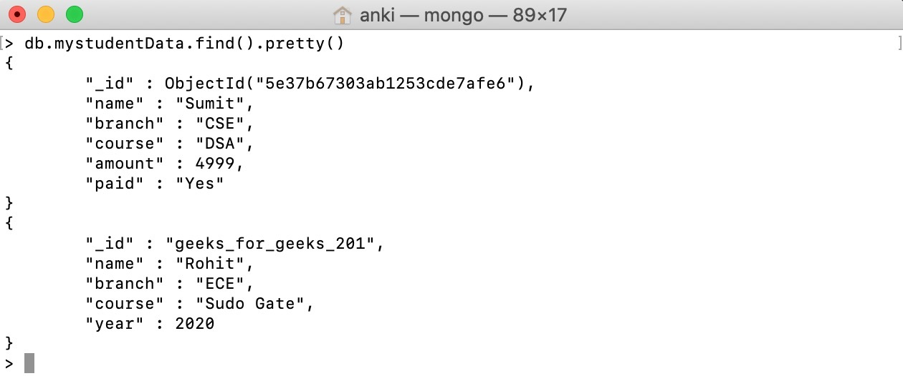

Databases, collections, documents are important parts of MongoDB without them you are not able to store data on the MongoDB server. A Database contains one or more collections, and a collection contains documents and the documents contain data, they are related to each other. 

# Database
In MongoDB, a database contains the collections of documents. One can create multiple databases on the MongoDB server.  

### View Database:
To see how many databases are present in your MongoDB server, write the following statement in the mongo shell:  
```mongosh
show dbs;
```

### View Collections
```mongosh
show collections
```

Naming Restriction for Database:
Before creating a database you should first learn about the naming restrictions for databases:  

In MongoDB, the names of the database are case insensitive, but you must always remember that the database names cannot differ only by the case of the characters.
For windows user, MongoDB database names cannot contain any of these following characters:
```markdown
/\. "$*:|?
```


For Unix and Linux users, MongoDB database names cannot contain any of these following characters: 
```markdown
/\. "$
```

MongoDB database names cannot contain null characters(in windows, Unix, and Linux systems).
MongoDB database names cannot be empty and must contain less than 64 characters. 

# Creating Database:
In the mongo shell, you can create a database with the help of the following command:  
```mongosh
use database_name
```

This command actually switches you to the new database if the given name does not exist and if the given name exists, then it will switch you to the existing database. Now at this stage, if you use the show command to see the database list where you will find that your new database is not present in that database list because, in MongoDB, the database is actually created when you start entering data in that database. 

# Collection
Collections are just like tables in relational databases, they also store data, but in the form of documents. A single database is allowed to store multiple collections.  

### Schemaless:
As we know that MongoDB databases are schemaless. So, it is not necessary in a collection that the schema of one document is similar to another document. Or in other words, a single collection contains different types of documents like as shown in the below example where mystudentData collection contain two different types of documents: 


# Naming Restrictions for Collection:
Before creating a collection you should first learn about the naming restrictions for collections: 

Collection name must starts with an underscore (`_`) or a letter (a-z or A-Z)
Collection name should not start with a number, and does not contain $, empty string, null character and does not begin with prefix `system.` as this is reserved for MongoDB system collections.
The maximum length of the collection name is 120 bytes(including the database name, dot separator, and the collection name).

Creating collection:
After creating database now we create a collection to store documents. The collection is created using the following syntax: 
```mongosh
db.collection_name.insertOne({..})
```
or
```mongosh
db.createCollection("collection_name");
```
Here, insertOne() function is used to store single data in the specified collection. And in the curly braces {} we store our data or in other words, it is a document. 

# Naming restriction of fields:

The field names are of strings.
The _id field name is reserved to use as a primary key. And the value of this field must be unique, immutable, and can be of any type other than an array.
The field name cannot contain null characters.
The top-level field names should not start with a dollar sign ($).


### Document Size: 
The maximum size of the BSON document is 16MB. It ensures that the single document does not use too much amount of RAM or bandwidth(during transmission). If a document contains more data than the specified size, then MongoDB provides a GridFS API to store such type of documents.

### Listing items in a collection
```mongosh
db.collection_name.find();
```

### Counting the number of items in a collection
```mongosh
db.collection_name.countDocuments();
```

or

```mongosh
db.collection_name.find().count()
```

or

```mongosh
db.collection_name.find().size()
```

### Adding documents to a collection
```mongosh
db.collection_name.insertOne({...})
```
or
```mongosh
db.collection_name.insertMany([{...}, {...}, ...])
```

### Limiting number of results
```mongosh
db.collection_name.find().limit(2);
```

### Sorting results
```mongosh
db.collection_name.find().sort();
```