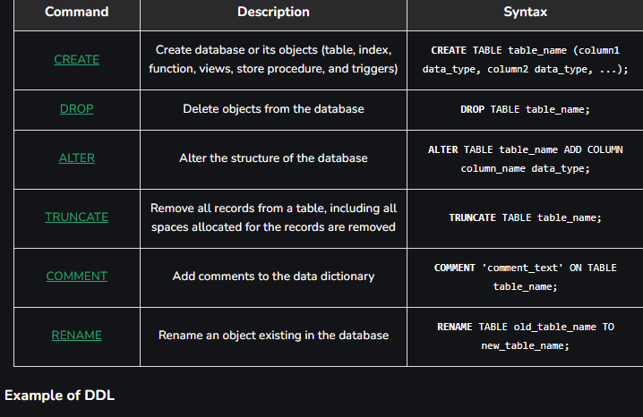
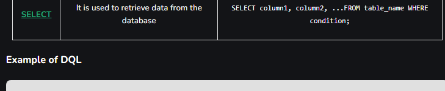
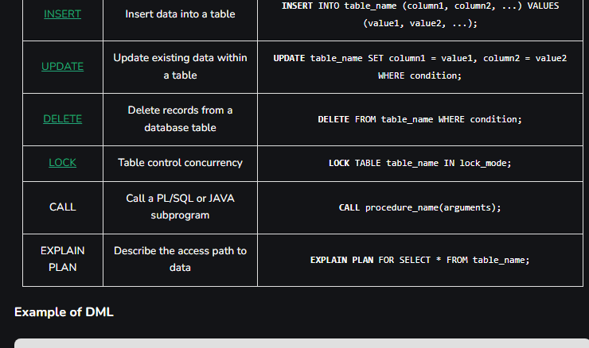
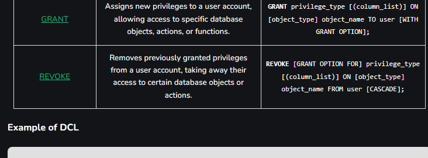
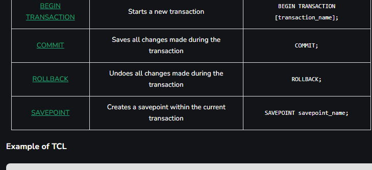

# SQL Commands | DDL, DQL, DML, DCL and TCL Commands

# What are SQL Commands?
SQL Commands are like instructions to a table. It is used to interact with the database with some operations. It is also used to perform specific tasks, functions, and queries of data. SQL can perform various tasks like creating a table, adding data to tables, dropping the table, modifying the table, set permission for users.

SQL Commands are mainly categorized into five categories: 

DDL – Data Definition Language
DQL – Data Query Language
DML – Data Manipulation Language
DCL – Data Control Language
TCL – Transaction Control Language

# 1. Data Definition Language (DDL) in SQL
DDL or Data Definition Language actually consists of the SQL commands that can be used to defining, altering, and deleting database structures such as tables, indexes, and schemas. It simply deals with descriptions of the database schema and is used to create and modify the structure of database objects in the database.

### Common DDL Commands


### Example of DDL
```sql
CREATE TABLE employees (
    employee_id INT PRIMARY KEY,
    first_name VARCHAR(50),
    last_name VARCHAR(50),
    hire_date DATE
);
```
In this example, a new table called employees is created with columns for employee ID, first name, last name, and hire date.

# 2. Data Query Language (DQL) in SQL
DQL statements are used for performing queries on the data within schema objects. The purpose of the DQL Command is to get some schema relation based on the query passed to it. This command allows getting the data out of the database to perform operations with it. When a SELECT is fired against a table or tables the result is compiled into a further temporary table, which is displayed or perhaps received by the program.

### DQL Command


### Example of DQL
```sql
SELECT first_name, last_name, hire_date
FROM employees
WHERE department = 'Sales'
ORDER BY hire_date DESC;
```
This query retrieves employees’ first and last names, along with their hire dates, from the employees table, specifically for those in the ‘Sales’ department, sorted by hire date.

# 3. Data Manipulation Language (DML) in SQL
The SQL commands that deal with the manipulation of data present in the database belong to DML or Data Manipulation Language and this includes most of the SQL statements. It is the component of the SQL statement that controls access to data and to the database. Basically, DCL statements are grouped with DML statements.

### Common DML Commands


### Example of DML
```sql
INSERT INTO employees (first_name, last_name, department) 
VALUES ('Jane', 'Smith', 'HR');
```
This query inserts a new record into the employees table with the first name ‘Jane’, last name ‘Smith’, and department ‘HR’.

# 4. Data Control Language (DCL) in SQL
DCL (Data Control Language) includes commands such as GRANT and REVOKE which mainly deal with the rights, permissions, and other controls of the database system. These commands are used to control access to data in the database by granting or revoking permissions.

### Common DCL Commands


## Example of DCL
```sql
GRANT SELECT, UPDATE ON employees TO user_name;
```
This command grants the user user_name the permissions to select and update records in the employees table.

# 5. Transaction Control Language (TCL) in SQL
Transactions group a set of tasks into a single execution unit. Each transaction begins with a specific task and ends when all the tasks in the group are successfully completed. If any of the tasks fail, the transaction fails. Therefore, a transaction has only two results: success or failure. We can explore more about transactions here.

### Common TCL Commands


### Example of TCL
```sql
BEGIN TRANSACTION;
UPDATE employees SET department = 'Marketing' WHERE department = 'Sales';
SAVEPOINT before_update;
UPDATE employees SET department = 'IT' WHERE department = 'HR';
ROLLBACK TO SAVEPOINT before_update;
COMMIT;
```
In this example, a transaction is started, changes are made, and a savepoint is set. If needed, the transaction can be rolled back to the savepoint before being committed.