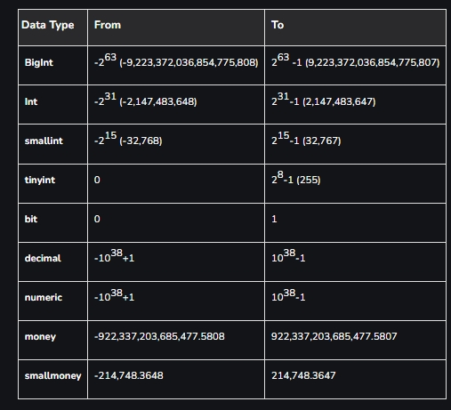
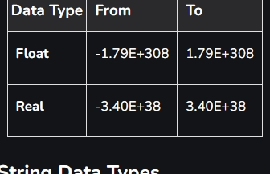
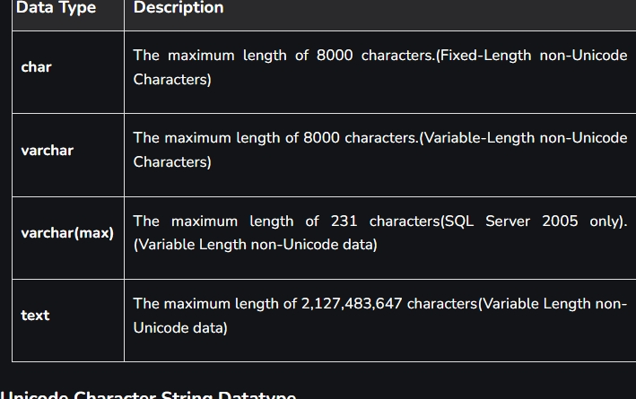
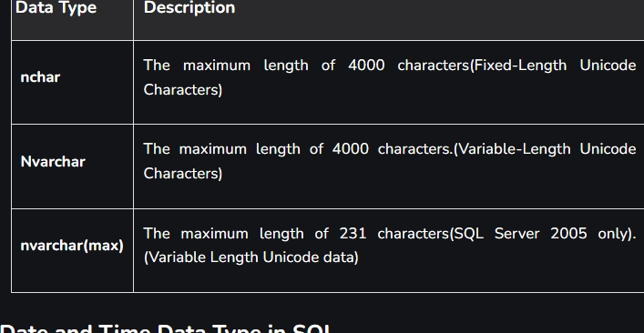
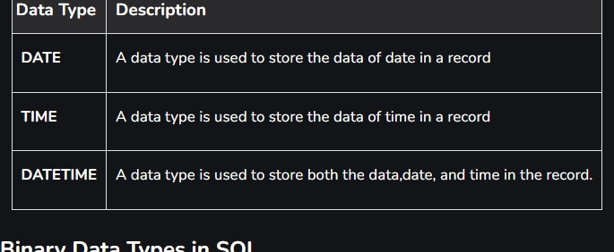
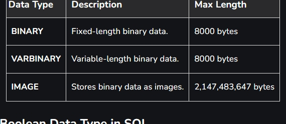
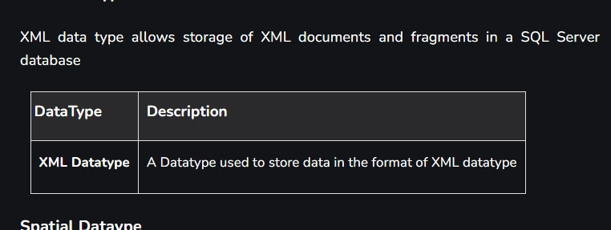
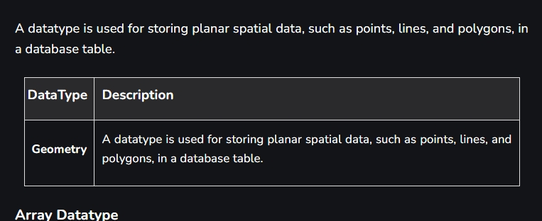

SQL Data Types are the pillar of relational database schema design. It ensures that data is stored efficiently and accurately. Data types define the type of value a column can hold, such as numbers, text, or dates. Understanding SQL Data Types is critical for database administrators, developers, and data analysts to design robust databases and optimize performance.

# Why SQL Data Types Matter
Choosing the right SQL Data Type is crucial for:

### Data Integrity: 
Prevents invalid data from being entered into the database (e.g., storing text in a numeric column).

### Efficient Storage: 
Reduces storage costs by allocating only the necessary space for data.

### Query Performance: 
Improves query performance by enabling faster indexing and search operations.

### Application Compatibility: 
Ensures smooth interaction between the database and applications by enforcing consistency in data handling.

For instance, using DECIMAL instead of FLOAT for financial calculations ensures precision and avoids rounding errors, making it critical in industries like finance and e-commerce.

# Data Types
Numeric Datatypes
Character and String Data Types
Date and Time Data Types
Binary Data Types
Boolean Data Types
Special Data Types

# Numeric Data Types
Numeric data types are fundamental to database design and are used to store numbers, whether they are integers, decimals, or floating-point numbers. These data types allow for mathematical operations like addition, subtraction, multiplication, and division, which makes them essential for managing financial, scientific, and analytical data.

Exact Numeric Datatype
Exact numeric types are used when precise numeric values are needed, such as for financial data, quantities, and counts.

# Approximate Numeric Datatype
These types are used to store approximate values, such as scientific measurements or large ranges of data that don’t need exact precision.

# String Data Types
Character data types are used to store text or character-based data.

Character String Datatype

# Unicode Character String Datatype
Unicode data types are used to store characters from any language, supporting a wider variety of characters. 
These are given in below table.

# Date and Time Data Type in SQL

# Binary Data Types in SQL

# Boolean Data Type in SQL
Boolean data types are used to store logical values, typically TRUE or FALSE.
BOOLEAN	Stores a logical value (TRUE/FALSE).

# Other Special Data Types
### XML Datatype
XML data type allows storage of XML documents and fragments in a SQL Server database

### Spatial Dataype
A datatype is used for storing planar spatial data, such as points, lines, and polygons, in a database table.

# Array Datatype
SQL Server does not have a built-in array datatype. However, it is possible to simulate arrays using tables or XML data types.