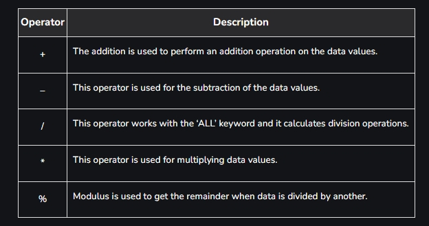
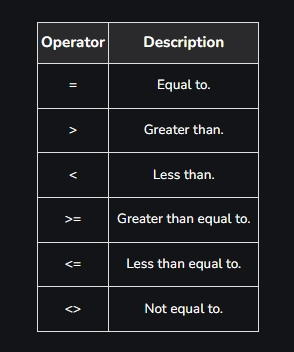
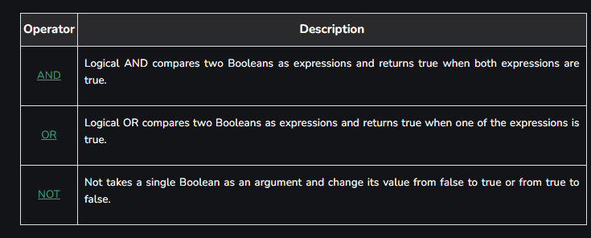
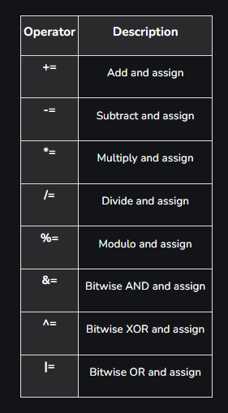
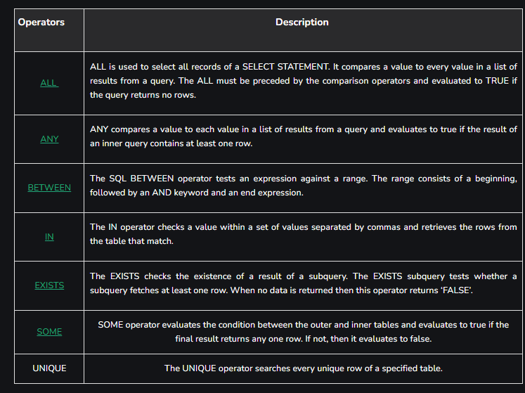

SQL operators are important in database management systems (DBMS) as they allow us to manipulate and retrieve data efficiently. Operators in SQL perform arithmetic, logical, comparison, bitwise, and other operations to work with database values. Understanding SQL operators is crucial for performing complex data manipulations, calculations, and filtering operations in queries.

### Types of Operators in SQL
SQL operators can be categorized based on the type of operation they perform. Here are the primary types of SQL operators:

Arithmetic operator
Comparison operator
Logical operator
Bitwise Operators
Compound Operators

# SQL Arithmetic Operators
Arithmetic operators in SQL are used to perform mathematical operations on numeric values in queries. Some common arithmetic operators are:


### SQL Arithmetic Operators Example
In this example, we will retrieve all records from the “employee” table where the “emp_city” column does not start with the letter ‘A’.

Query:
```sql
SELECT * FROM employee WHERE emp_city NOT LIKE 'A%';
```

# SQL Comparison Operators
Comparison Operators in SQL are used to compare one expression’s value to other expressions. SQL supports different types of comparison operator, which are described below:


### SQL Comparison Operators Example
In this example, we will retrieve all records from the “MATHS” table where the value in the “MARKS” column is equal to 50.

Query:
```sql
SELECT * FROM MATHS WHERE MARKS=50;
```

# SQL Logical Operators
Logical Operators in SQL are used to combine or manipulate conditions in SQL queries to retrieve or manipulate data based on specified criteria.


### SQL Logical Operators Example
In this example, retrieve all records from the “employee” table where the “emp_city” column is equal to ‘Allahabad’ and the “emp_country” column is equal to ‘India’.

```sql
SELECT * FROM employee WHERE emp_city = 
'Allahabad' AND emp_country = 'India';
```

# SQL Bitwise Operators
Bitwise operators in SQL are used to perform bitwise operations on binary values in SQL queries, manipulating individual bits to perform logical operations at the bit level. Some SQL Bitwise Operators are


# SQL Compound Operators
Compound operator in SQL are used to perform an operation and assign the result to the original value in a single line. Some Compound operators are:


# SQL Special Operators
Special operators are used in SQL queries to perform specific operations like comparing values, checking for existence, and filtering data based on certain conditions.


# SQL Special Operator Example
In this example, we will retrieve all records from the “employee” table where the “emp_id” column has a value that falls within the range of 101 to 104 (inclusive).

```sql
SELECT * FROM employee WHERE emp_id BETWEEN 101 AND 104;
```