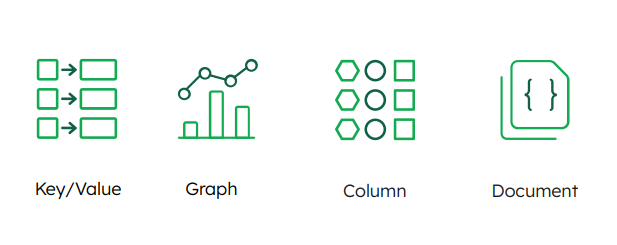
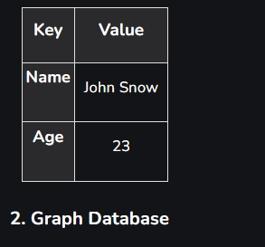
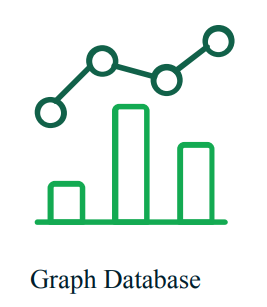
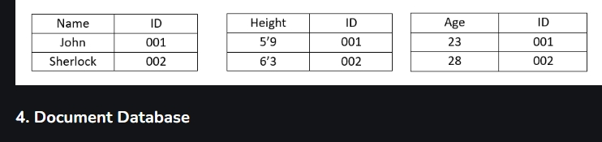
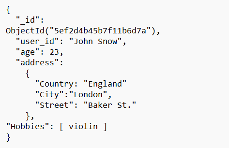
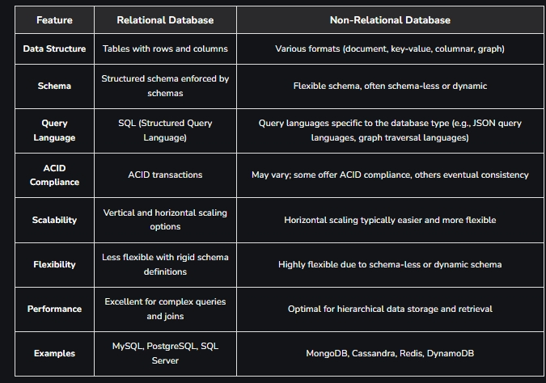

# Non-Relational Databases and Their Types

In the area of database management, the data is arranged in two ways which are Relational Databases (SQL) and Non-Relational Databases (NoSQL). While relational databases organize data into structured tables, non-relational databases use various flexible data models like key-value pairs, documents, graphs, and wide-column stores.

# Relational Database (SQL)
A relational database stores data in a table composed of rows and columns. The table represents an object or entity, such as users, customers, orders, etc.
The column represents the type of data that can be stored in the respective column.
Relational Databases allow users to establish a connection between tables using keys for flexible data flow and querying.
SQL was specifically designed to work with tabular data. These are often categorized as structured data.
This is because there can only be a single schema or structure for the data within a relational database.
SQL is a [ *_declarative language_* ] , which means that you describe in SQL syntax the desired result you wish from the query.

# Non-Relational database (NoSQL)
Non-relational databases different from relational databases because they do not store data in tabular form.
Instead, non-relational databases are based on data structures like documents and graphs. NoSQL databases also come in a variety of types based on their data models.
They offer scalability when dealing with large volumes of data and high load factors. They were designed when data was expected to be partitioned across multiple machines to scale, in contrast to relational databases, which assumed the data would stay on a single machine.

# The benefits of a non-relational database
Scalability: 
Non-relational databases like MongoDB and Cassandra are designed to horizontally scale across clusters of cheap commodity hardware, offering seamless scalability as data volumes and user loads increase.

Flexibility in Data Models: 
Unlike rigid table-based structures in relational databases, non-relational databases support flexible data models like document stores (e.g., JSON in MongoDB), key-value pairs (e.g., Redis), and wide-column stores (e.g., Cassandra), making it easier to store and manage unstructured or semi-structured data.

Performance: 
Non-relational databases are optimized for specific use cases such as real-time data ingestion, high-speed transactions, and rapid access to large volumes of data. They often outperform relational databases in these scenarios due to their distributed architecture and optimized data storage formats.

Schemaless Design: 
Non-relational databases typically do not enforce a rigid schema, allowing developers to evolve the data structure over time without downtime or complex migrations. This advantage is particularly beneficial in agile development environments and for handling diverse and unpredictable data types.

High Availability and Fault Tolerance: 
Many non-relational databases are designed with built-in replication and automatic failover capabilities, ensuring high availability and data redundancy. This makes them suitable for mission-critical applications where continuous uptime is essential.

Cost-Effectiveness: 
By using commodity hardware and open-source software, non-relational databases often provide a more cost-effective solution compared to traditional relational databases, especially at scale.

# What do NoSQL databases have in common?
Non-Relational Structure: 
NoSQL databases store data in flexible formats like key-value pairs, documents, or graphs, allowing for easier adaptation to changing data needs.

Scalability: 
It is Designed for horizontal scaling across multiple servers, enabling efficient handling of large data volumes and high transaction rates.

High Performance: 
It is Highly Optimized for specific query types and workloads, prioritizing low latency and high throughput.

Flexibility in Data Models: 
It Supports various data structures (e.g., documents, columns, graphs) to fit diverse application requirements without rigid schemas.

Eventual Consistency: 
It Emphasizes availability and partition tolerance over strict immediate consistency across distributed nodes.

Horizontal Partitioning: 
It Uses sharding to distribute data across multiple nodes, improving performance and managing large datasets efficiently.

# Non-Relational Database Types
There are four main types of non-relational databases:

key/value
graph
column
document

# Key-value databases - i.e Redis
use a straightforward schema: a unique key is paired with a collection of values, where the values can be anything from a string to a large binary object. One of the benefits of using this structure in a database is that you don’t have to worry about complex queries. Because the system knows where the data is stored, it only sends a request to that particular server.

# Graph database i.e Neo4J
is another type of non-relational database. A popular example of a graph database is Neo4J. This database stores information as a collection of nodes and edges, where the edges represent the relationships between the nodes.

# A column-oriented or wide-column non-relational database i.e Cassandra 
is primarily designed for analytics. Cassandra is a commonly used column-oriented database.

The advantage of column-oriented/row-oriented databases is that column-oriented databases return data in columns, making the query much more performant as it will not return many irrelevant fields that are not required for the query being serviced.

The primary key in a column-oriented database is the data or value, which is then mapped to row keys. This is the inverse, or opposite, of how the primary key works in a relational database.

# Document databases, such as MongoDB, 
store data in a single document, which can have different shapes within the single collection or table that stores the documents. It provides a clear means of capturing relationships using sub-documents and embedded arrays within a single document.

# Non-Relational Database Management Systems
Some of the popular Non-Relational Database Management Systems are:

MongoDB
Apache Cassandra
Redis
Couchbase
Apache HBase
Neo4j
Riak
Aerospike
OrientDB
ArangoDB

