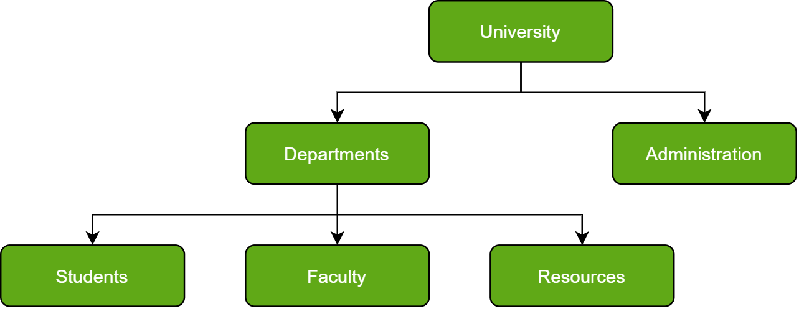
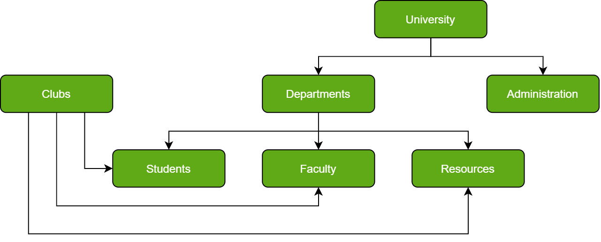
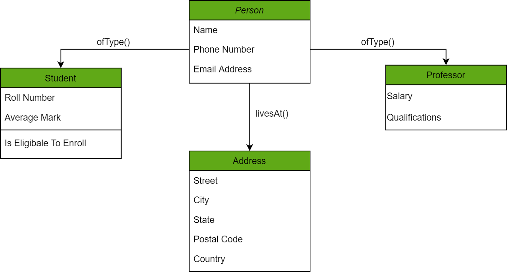
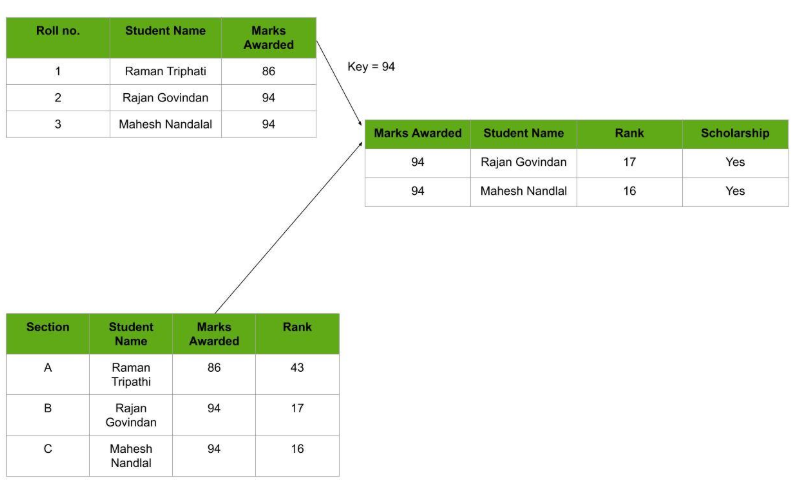

# Types of Databases
There are several types of databases, that are briefly explained below.

Hierarchical databases
Network databases
Object-oriented databases
Relational databases
Cloud Database
Centralized Database
Operational Database
NoSQL databases

# Hierarchical Databases
As in any hierarchy, this database follows the progression of data being categorized in ranks or levels, 
wherein data is categorized based on a common linkage. 
As a result, two entities of data will be lower 
in rank and the commonality will assume a higher rank

Do note how Departments and Administration are entirely unlike each other and yet fall under the domain of a University. They are elements that form this hierarchy. 

Another perspective advises visualizing the data being organized in a parent-child relationship, 
which upon the addition of multiple data elements would resemble a tree. The child records are linked to the parent record using a field, so the parent record is allowed multiple child records. However, vice versa is not possible. 

Notice that due to such a structure, hierarchical databases are not easily scalable; the addition of data elements requires a lengthy traversal through the database.

# Network Databases
In Layman’s terms, a network database is a hierarchical database, but with a major tweak. 
The child records are given the freedom to associate with multiple parent records. 
As a result, a network or net of database files linked with multiple threads is observed. 
Notice how the Student, Faculty, and Resources elements each have two parent records, 
which are Departments and Clubs. 

Certainly, in complex framework, network databases are more capable of representing two-directional relationships. 
Also, conceptual simplicity favors the utilization of a simpler database management language. 
The disadvantage lies in the inability to alter the structure due to its complexity 
and also highly structure dependent. 

# Object-Oriented Databases
Those familiar with the Object-Oriented Programming Paradigm would be able to relate to this model of databases easily. Information stored in a database is capable of being represented as an object that responds as an instance of the database model. Therefore, the object can be referenced and called without any difficulty. As a result, the workload on the database is substantially reduced.

In the chart above, we have different objects linked to one another using methods; one can get the address of the Person (represented by the Person Object) using the latest() method. Furthermore, these objects have attributes which are in the data elements that need to be defined in the database. 

An example of such a model is the Berkeley DB software library which uses the same conceptual background to deliver quick and highly efficient responses to database queries from the embedded database. 

# Relational Databases
Considered the most mature of all databases, these databases lead in the production line along with their management systems. In this database, every piece of information has a relationship with every other piece of information. This is on account of every data value in the database having a unique identity in the form of a record. 

Note that all data is tabulated in this model. Therefore, every row of data in the database is linked with another row using a primary key. Similarly, every table is linked with another table using a foreign key. 

Refer to the diagram below and notice how the concept of ‘Keys’ is used to link two tables. 

Due to this introduction of tables to organize data, it has become exceedingly popular. In consequence, they are widely integrated into Web-Ap interfaces to serve as ideal repositories for user data. What makes it further interesting in the ease in mastering it, since the language used to interact with the database is simple (SQL in this case) and easy to comprehend.

It is also worth being aware of the fact that in Relational databases, scaling and traversing through data is quite a lightweight task in comparison to Hierarchical Databases. 

# Cloud Databases
A cloud database is used where data requires a virtual environment for storing and executing over the cloud platforms and there are so many cloud computing services for accessing the data from the databases (like SaaS, Paas, etc).

There are some names of cloud platforms are-

Amazon Web Services (AWS)
Google Cloud Platform (GCP)
Microsoft Azure
ScienceSoft, etc.

# Centralized Databases
A centralized database is a type of database that is stored, located as well as maintained at a single location and it is more secure when the user wants to fetch the data from the Centralized Database.

Advantages
Data Security
Reduced Redundancy
Consistency
Disadvantages
The size of the centralized database is large which increases the response and retrieval time.
It is not easy to modify, delete and update.

# Personal Databases
Collecting and Storing the data on its System and this type of databases is basically designed for the single user. A personal database is a small, single-user database designed to manage data for individual use, typically on a personal computer or mobile device. It is often used for managing personal information like contacts, budgets, or notes. Personal databases are lightweight, easy to use, and do not require advanced database administration. They are ideal for individuals or small tasks where only one user interacts with the data, as opposed to multi-user or enterprise databases. Examples include Microsoft Access and SQLite.

Advantages
It is easy to handle
It occupies less space

# Operational Databases
It is used for creating, updating, and deleting the database in real-time and it is designed for executing and handling the daily data operation in organizations and businesses purposes.

Advantages
easy to fetch.
Structured data
Real-time processing

# NoSQL Databases
A NoSQL originally referring to non SQL or non-relational is a database that provides a mechanism for storage and retrieval of data. This data is modeled in means other than the tabular relations used in relational databases. 

A NoSQL database includes simplicity of design, simpler horizontal scaling to clusters of machines, and finer control over availability. The data structures used by NoSQL databases are different from those used by default in relational databases which makes some operations faster in NoSQL. The suitability of a given NoSQL database depends on the problem it should solve. Data structures used by NoSQL databases are sometimes also viewed as more flexible than relational database tables. 

MongoDB falls in the category of NoSQL document-based database. 

Advantages of NoSQL
Easily scales horizontally by adding more servers.
Can be run on commodity hardware, lowering costs.
Optimized for large volumes of data and fast queries.
Handles unstructured, semi-structured, or structured data.
Disadvantages of NoSQL  
NoSQL has the following disadvantages.  

NoSQL is an open-source database.
GUI is not available
Backup is a weak point for some NoSQL databases like MongoDB.
Large document size. 